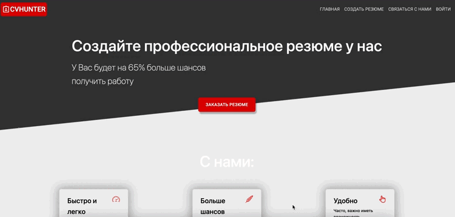
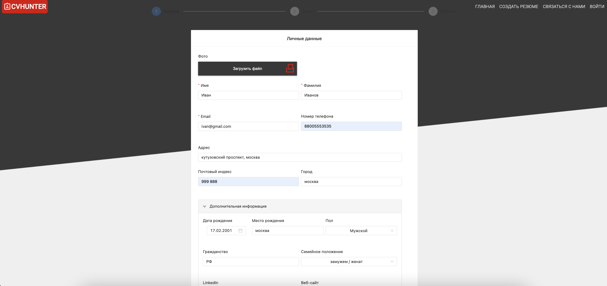
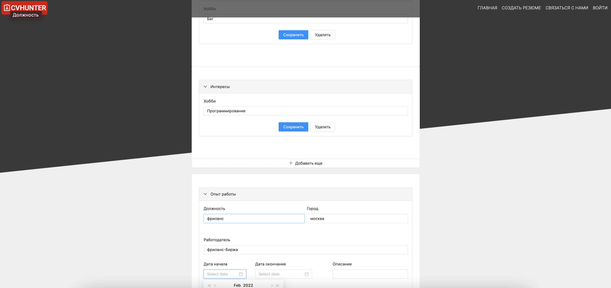
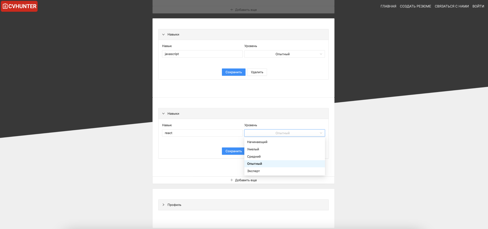
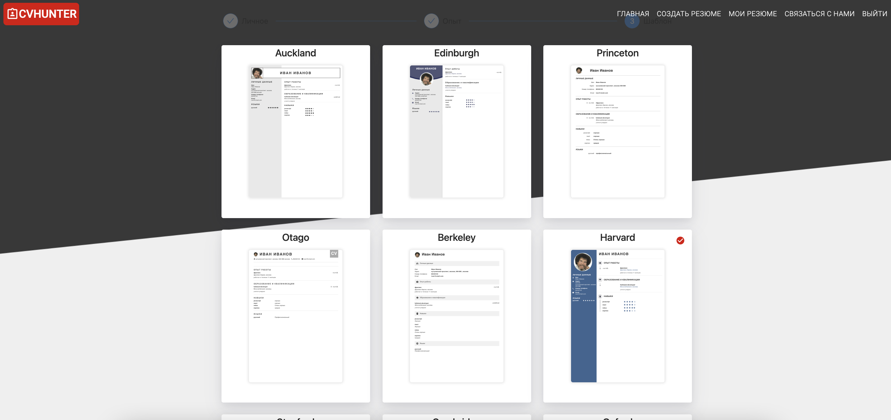
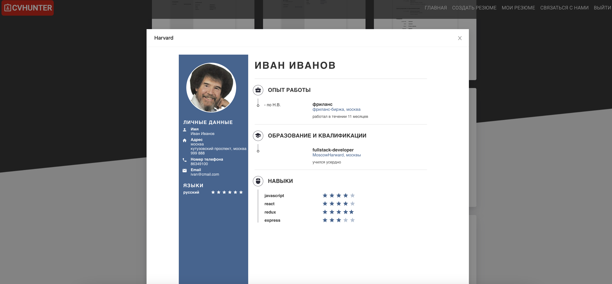
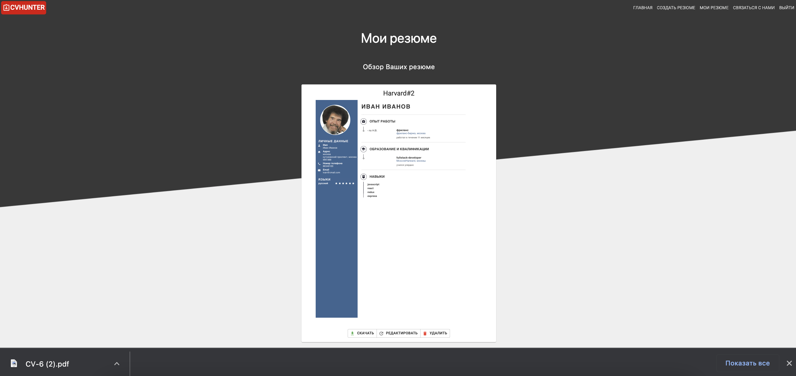
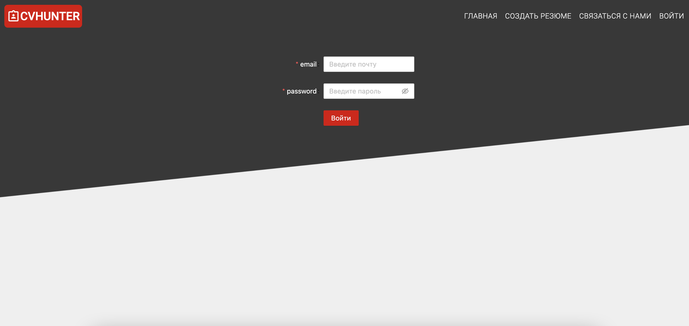
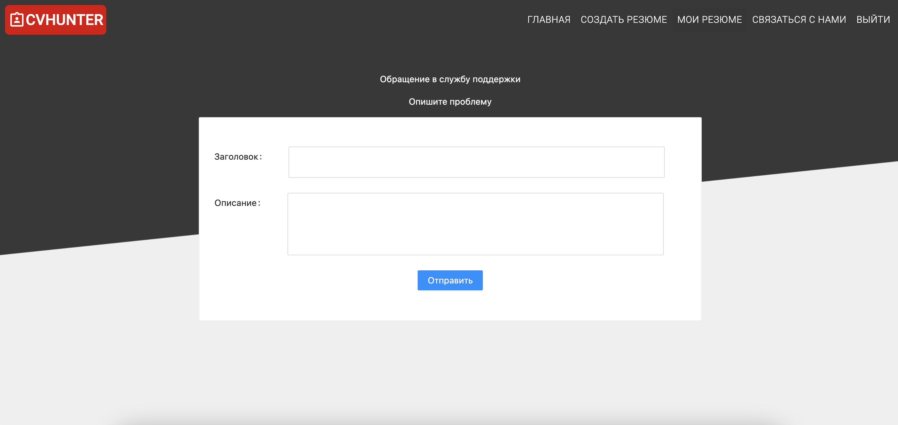

# CVHunter

### Веб приложение для помощи в создании резюме. Если вы хотите не тратить время на составление резюме, можете воспользоваться веб приложением CVHunter, и съэкономить значительное количество времени, и потратить его на поиск работы а не осоставление резюме!

### стек:

 
Стек Фронт: React, Redux, Redux-Thunk, Typescript, AntDesign, MaterialUI, IFrame, JWT, Axios
 

Стек Бэк: NestJS, TypeScript, Sequelize, PostgreSQL, JWT, HandleBars, PDFGenerator, MailerSMTP

# функционал

на первом этапе нас встречают формы основной информации о клиенте

двигаясь дальше к второму этапу мы переходим к заполнению инфорации для резюме.
Ограничения по количеству форм для заполнения инфорации нету, таким образом резюме может содержать сколь угодно страниц.

на третьем этапе клиент может выбрать шаблон для резюме из 9 вариантов

при нажатии на шаблон он откроется и его можно рассмотреть детальнее

когда клиент нажмет на кнопку скачать он автоматически залогинется на сайте и его перекинет в личный кабинет с его резюме а так же начнется скачивание шаблона в формате PDF

во вкладке мои резюме имеется функционал скачивания имеющихся резюме, удаления и редактирования

если пользователь выйдет из акаунта или его сессия закончится он сможет войти на сайт использую логин и пароль который пришел ему на почту

если у пользователя возникнут какие либо вопросы он может оставить обртную связь и с ним свяжутся по почте под которой он зарегестрирован

сайт адаптирован под мобильные устройства

# Возможности для расширения

- онлайн чат с поддержкой
- оплата перед скачиванием резюме
- перевод сайта на другие языки для расширения и привлечения новых клиентов
